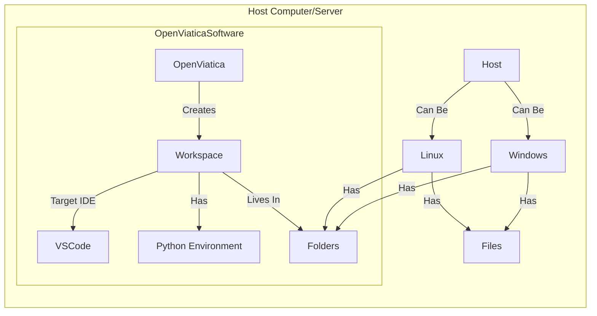

# Open Viatica Developer Documentation

Ok, is everyone else gone? Just you and me?
 
All right, lets get technical.
  
Look, I like to document a lot of things with diagrams, so most of it is going to be like that.
 
If the diagrams are not up to standard I am just going to blame it on my bad mermaid skills
  
Although the purpose of most of these diagrams are to show what features and things the program will do, it could become the main navigation tool for the code, idk.
 
It might make it harder to document a full list if features for tracking and the like but its what really makes sense to me, so lets start.
  
NOTE: ALL clickable diagrams has to be flowchart unless someone can show me a way to do it while meeting my diagram requirements. (PS I´d really prefer ER/Requirement diagrams for a lot of what I am going to document but oh well. I have not found out a way to link them)

# OpenViatica 
## Philosophy & Design
This section will contain all high level the information of the OpenViatica project and it will also contain the Philosophy and design of what the OpenViatica tool is supposed to help with.

1. OpenViatica should be considered something like an engine for data analysis workspace creation & management. 
2. The features it implements should directly tie to the creation of a new workspace or the management of an existin one.
3. Whenever there are thirs party tools that can fulfill the requirements, we will always use that tool. If not, then we will make our own or build on top of it to fulfill the requirements.
4. OpenViatica should be designed to be usable from the smallest data analyst to the largest data analysis companies.
    1. It will accomplish this goal by being a local-first, but cloud integrated solution for data analytics
5. To accomplish this the features needed for a solo developer analyst to use the tools will be supported on the Windows platform, the other features would be supported in linux only.
  
OpenViatica is designed to be a local-first but cloud-integrated workspace manager. The idea is that it is easy enough for beginners to ues but deep enough for large cross functional teams in an organization.
 
## OpenViatica Interactions Diagram

The purpose of this diagram is to show what the OpenViatica Software does and what interactions are with things that are externally to itself

<svg width="200" height="100" xmlns="http://www.w3.org/2000/svg">
  <a href="https://example.com" target="_blank">
    <rect x="10" y="10" width="180" height="80" fill="lightblue" stroke="black"/>
    <text x="20" y="50" font-size="16">Click me!</text>
  </a>
</svg>

Workspace ==> |Preferred IDE| VSCode
    Workspace ==> |Has| P_Env["Python Environment"]
    Workspace --> |Has| Folders
    
    Workspace --> |Has| Files
        Files --> |Can Be| Code
        Files --> |Can Be| Data
        Files --> |Can Be| Configurations
    
    
    
      
    Linux --> |Has| Access_Control
    Linux --> |Has| User_Groups
    Access_Control --> |Controls Access| Folders
    Access_Control --> |Controls Access| Files
    
    Workspace --> |Has| Code
OpenViatica --> OpenViaticaMap 
    OpenViatica --> OpenViaticaCodeFlow
    OpenViatica --> OpenViaticaAI
Project_Source/Documentation/Code_Documentation/OpenViatica/README.md
