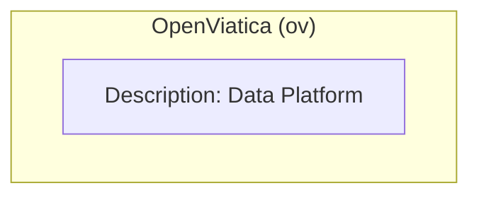

# Open Viatica Developer Documentation

Ok, is everyone else gone? Just you and me?
 
All right, lets get technical.
 
Look, I like to document a lot of things with diagrams, so most of it is going to be like that.
 
If the diagrams are not up to standard I am just going to blame it on my bad mermaid skills
 
Although the purpose of most of these diagrams are to show what features and things the program will do, it could become tha main navigation tool for the code, idk.
 
It might make it harder to document a full list if features for tracking and the like but its what really makes sense to me, so lets start.
 
NOTE: ALL clickable diagrams has to be flowchart unless someone can show me a way to do it while meeting my diagram requirements. 

# OpenViatica Interactions Diagram

The purpose of this diagram is to show what the OpenViatica Software interacts with externally to itself

